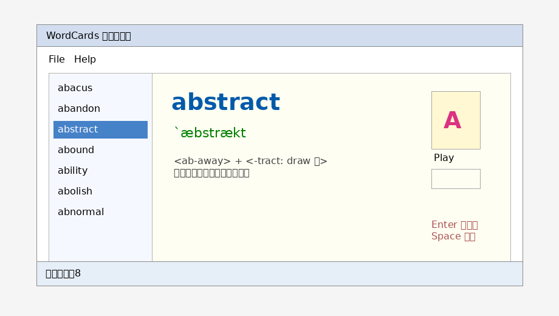

# WordCards 單字卡程式

學號：1123305  
姓名：范宸瑋

## 專案簡介

本專案為「視窗程式設計 (II)」的單字卡程式。程式會在啟動時讀取 `WordCards.txt`，將每一列 TSV 資料轉成 `WordItem`，並放入 `WordCollection` 自訂集合中，再顯示於 Windows Forms 介面。

TSV 欄位格式：

```text
Word<TAB>Phonogram<TAB>SoundPath<TAB>Explain...
```

## 主要功能

1. 啟動時自動讀取 `WordCards.txt`。
2. 左側 `ListBox` 顯示所有單字。
3. 右側顯示單字、音標與解釋。
4. 按下 `Play` 可播放目前單字音檔。
   - 本版已為每個範例單字各自放入獨立 WAV 音檔，避免不同單字播放到同一個聲音。
5. 支援自動播放，Timer 間隔為 2000 ms。
6. 按 `Enter` 前往下一個單字。
7. 按 `Space` 重覆播放目前單字。
8. 雙擊單字可開啟編輯表單修改單字、音標、音檔路徑與解釋。
9. 修改後會自動儲存回 `WordCards.txt`。
10. 提供 `File -> Open / Exit` 與 `Help -> About` 功能表。

## 執行方式

1. 使用 Visual Studio 2022 開啟 `WordCards.sln`。
2. 確認已安裝 `.NET Framework 4.8 Developer Pack`。
3. 直接按 `F5` 執行。
4. 如果使用自己的單字檔，請放在輸出目錄，或使用 `File -> Open` 開啟 `.txt` / `.tsv` 檔。

## 專案結構

```text
WordCards/
├── WordCards.sln
├── WordCards.csproj
├── Program.cs
├── frmWordCards.cs
├── frmEditWord.cs
├── frmAbout.cs
├── WordItem.cs
├── WordCollection.cs
├── WordCards.txt
├── Sound/A/*.wav
├── docs/screenshot_wordcards.png
└── .gitignore
```

## 執行畫面



## GitHub 注意事項

上傳 GitHub 前請不要提交以下資料夾：

- `.vs/`
- `bin/`
- `obj/`
- `.git/`（壓縮繳交時也不要放入）

`.gitignore` 已經加入 Visual Studio 常見忽略規則。
